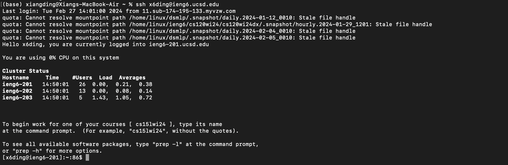
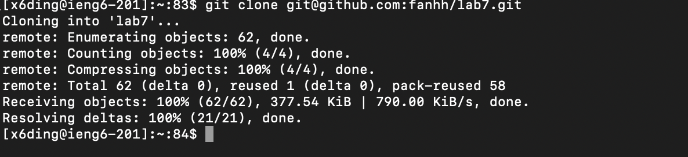
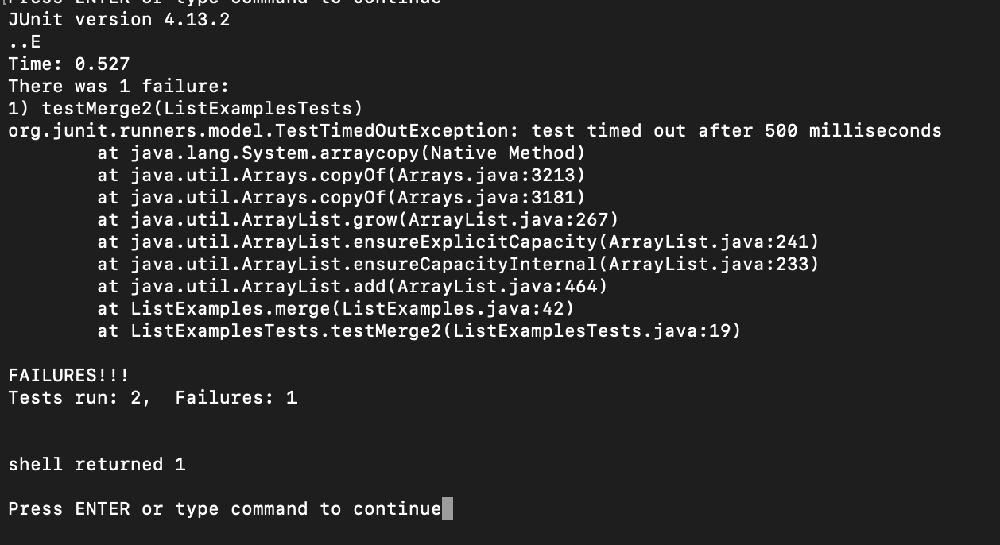
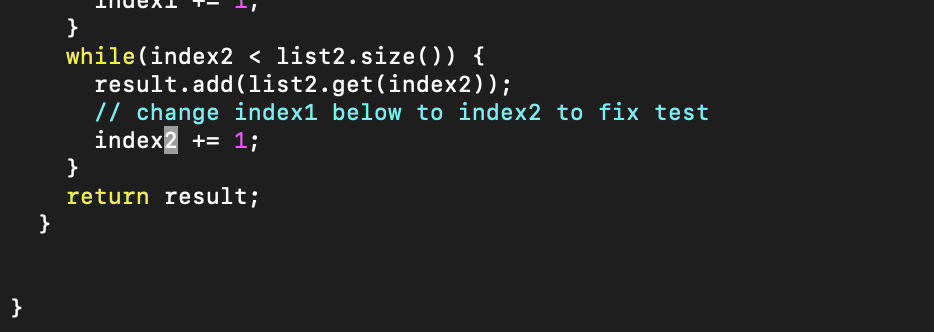
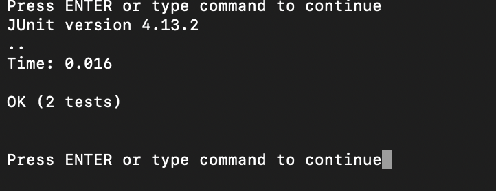
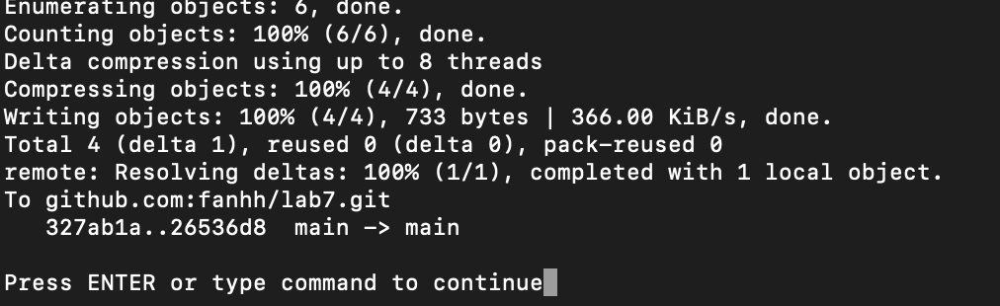
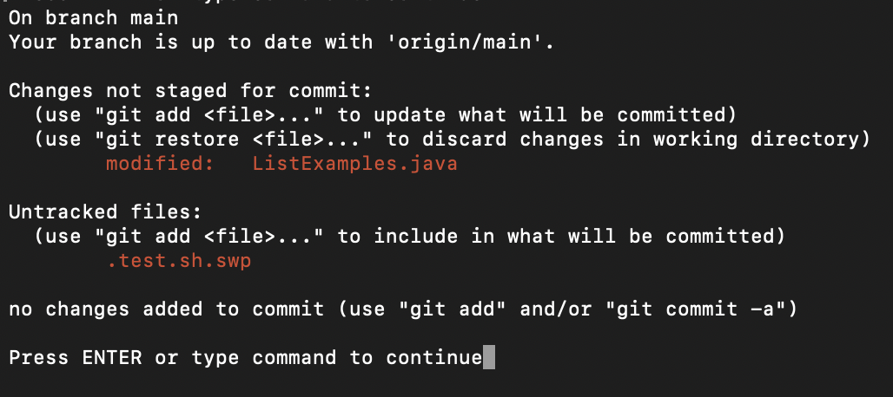

step 4
key pressed: ```ssh x6ding@ieng6.ucsd.edu```



step 5
key pressed: ```git clone git@github.com:fanhh/lab7.git```



step 6
key pressed: ```vim lab7/*```  ```:e test.sh``` ```!bash test.sh```


step 7
key pressed: ```:e ListExamples.java``` ```<UP><UP><UP><UP><UP><UP><Right><Right><Right> <Right><Right>``` ```i2``` ```<delete>2``` ```ese``` ```:wq<enter>```


step 8
key pressed: ```:e test.sh``` ```!bash test.sh```



step 9
key pressed: ```!git status``` ```!git add .``` ```!git commit -m'edit files'``` ```!git push```


